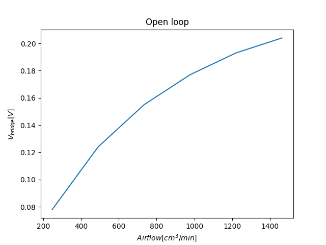

# Mass airflow sensor

Daniel Štanc, Jakub Jíra

Measured: 14.3.2023, Documented: 9.5.2023

repository: [japawBlob/B3M38ASE-labs](https://github.com/japawBlob/B3M38ASE-labs)

## Princip mass airflow senzoru

Hlavní funkcionalita senzoru je založená na malém zahřívaném vodiči, který je dán do cesty toku vzduchu. Jak je prouděním vzduchu drát ochlazován, my jsme schopni zjistit rychlost vzduchu, která je na dané ochlazení potřeba a z ní i hmotnost vzduchu, při známém průřezu. Hlavní měřenou jednotkou zde je hmotnost, jelikož objem je v rámci různých teplot a tlaků nestabilní. 

Pokud bychom takovýto senzor umístili do volného prostoru, budeme stejným principem schopni měřit rychlost vzduchu.

Během laboratoře jsme ze zapojení změřili topící proud, ze kterého jsme vypočítali odpor součástky PT100 a jeho teplotu

$$ R_{PT100} = {U_{Vcc}-U{4}\over I_4} = { 6.5 - 0.393 \over 0.0393 } = 155.4\Omega $$

Teplota spočtena z rovnice (2)

$$ t = 141.8\degree C $$

Při fungování v closed loop je změna mnohem rychlejší oproti zapojení v open loop. Nemonitoruje se změna odporu a tedy i napětí, která odpovídá změně teploty. Místo toho se napětí a teplota na rezistoru udržuje konstantní a monitoruje se změna v topném proudu, který je potřeba pro udržení dané teploty.

## Open-loop configuration

Námi naměřené hodnoty při open-loop zapojení byly následující:

|Airflow [$cm^3/min$]| Napětí na můstku[$V$]|
|:----:|:----:|
| 248 | 0.078 |
| 491 | 0.124 |
| 734 | 0.155 |
| 977 | 0.177 |
| 1220 | 0.193 |
| 1463 | 0.204 |

Znázorněno na grafu:

## Closed-loop configuration

Pro closed loop měření jsme nastavili PID regulátor na následující hodnoty:

$$ P = 250, I = 50, D = 25 $$

Námi naměřené hodnoty při closed-loop zapojení byly následující:

|Airflow [$cm^3/min$]| Proud na Pt100[$A$]|
|:----:|:----:|
| 248 | 0.0462 |
| 491 | 0.0507 |
| 734 | 0.0531 |
| 977 | 0.0557 |
| 1220 | 0.057 |
| 1463 | 0.0586 |

Znázorněno na grafu:

Pro výpočet zpětné charakteristiky je použit následující vztah:

$$I^2 = a + b\sqrt{Q_m}$$

Z námi naměřených dat si můžeme udělat graf a nafitovat přímku.

|$\sqrt{Airflow}$ [$\sqrt{cm^3/min}$]| $(I_{pt100})^2$ [$A^2$]|
|:----:|:----:|
| 15.7 | 0.0021 |
| 22.2 | 0.0026 |
| 27.1 | 0.0028 |
| 31.3 | 0.0031 |
| 34.9 | 0.0032 |
| 38.2 | 0.0034 |

Koeficienty z našeho fitu vyšly následovně:

$$ a = 1.268 * 10^{-3};\ b = 5.726 * 10^{-5} $$

tedy

$$ I^2 = {1.268\over10^{3} } + {5.726\over10^5} \sqrt{Q_m} $$

z toho $Q_m$

$$ Q_m = ({I^2 - {1.268\over10^{3} } \over {5.726\over10^5} })^2 g/min $$