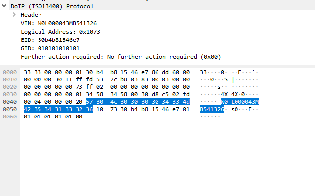

# Diagnostics over internet protocol

Daniel Štanc, Jakub Jíra

Measured: 16.5.2023, Documented: 17.5.2023

repository: [japawBlob/B3M38ASE-labs](https://github.com/japawBlob/B3M38ASE-labs)

## Introduction

Deployment of Electronic fuel injection control required new approach to vehicle and its components
monitoring and diagnosis. Microprocessor-based Electronic Control Units (ECU) in the eighties and nighties starts to
offer some diagnostics capabilities. Usually by some car manufacture specific protocols and tools. This
inconsistent approach makes independent evaluation of car condition difficult. Actual trend in passenger
vehicles is standardization of certain areas e.g. communication protocols, diagnostics protocols etc. The
laboratory is focused on DoIP transport layer (ISO 13400-2) and UDS application layer (ISO 14229-3).

## Capturing Vehicle Anouncement Message

Firstly we set up the Kvaser Hybrid CAN driver and sent a specific message to the ECU about engine ignition. This message is necessary for the ECU to work correctly. 

After the CAN network and connection with the PC is set up, we can observe the communication on the CAN0 network, using ```candump can0``` in wsl terminal windows.

Using Wireshark we sniffed Ethernet2 communication and found Vehicle Announcement Message. A snippet of the messages header is on following picture: 



## Communication with ECU

By analyzing the previous message, we found IP address of ECU: ```fd53:7cb8:383:3::73```

We pinged the address and observed responses both in terminal and in Wireshark.

Followingly we opened included python scripts ```SendDoIP.py``` and ```SendUDS.py``` We confirmed that entered values of IP address and logical address match our observed values. That being:

```
IP adress: fd53:7cb8:383:3::73
Logical adress: 0x1073
```

Then we sent and observed messages in Wireshark. Since UDS is a request-response protocol, we observed both requests and responses.

One captured communication in Wireshark is show below:

```json
"3616","295.634948","fd53:7cb8:383:3::10","fd53:7cb8:383:3::73","89","UDS","Request Read Data By Identifier","0xf187"

"3619","295.688311","fd53:7cb8:383:3::73","fd53:7cb8:383:3::10","100","UDS","Reply Read Data By Identifier","0xf187 35 45 33 30 33 35 38 37 34 20 20"
```

From captured communication, we can see IP addresses which communicated - as we can see, one of them is previously captured IP of ECU. Then we can see the protocol as ```UDS```. Following is ```Request/Response Read Data By Identifier```, which is an interpretation of used UDS service with the number ```0x22``` and ```0x62``` respectively. Then we get to the actual payload of the message. Consisting of identifier ```0xf187```, which is present in both request and response and data ```35 45 33 30 33 35 38 37 34 20 20```, present only in the response message.

This identifier corresponds with the value described as *VehicleManufacturerSparePartNumberDataIdentifier in the documentation*.