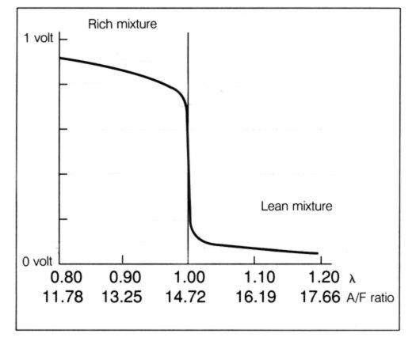

# Lambda sensors (oxygen sensors)

Daniel Štanc, Jakub Jíra

Measured: 7.3.2023, Documented: 9.5.2023

repository: [japawBlob/B3M38ASE-labs](https://github.com/japawBlob/B3M38ASE-labs)

## Lambda a AFR

AFR znamená Air-Fuel Ratio. Představuje to poměr hmotnosti vzduchu k hmotnosti paliva, při kterém dochází ke spalování. 

Lambda $\lambda$ symbolizuje poměr mezi skutečným AFR a AFR stoichiometrie - ideálního spalování. $\lambda$ = 1.0 při stochiometrii. 

$$ \lambda = {AFR \over AFR_{stoich.}} $$

Kde, zhruba  

$$ AFR_{stoich.} = 14.7 $$

Závislost výstupního signálu na lambdě/AFR je vidět na následujícím obrázku:

## Výpočet spotřeby motoru

Námi změřené hodnoty z lambda sondy:

$$ AFR = 14.45;  \lambda = 0.99 $$

Frekvence změřená na osciloskopu:

$$ f = 69.5Hz => 35\ otáček $$

Průtok vzduchu naměřený rotametrem:

$$ V/t = 2.1l/min $$

Z těchto hodnot jsme schopni spočitat spotřebu motoru. Když víme AFR a hmotnost vzduchu, který proteče za minutu tak:

$$ spotřeba\ [g/min] = {průtok\ vzduchu \ [g/min] \over AFR} $$

Po dosazení nám vyšlo:

$$ spotřeba = 0.181g/min $$

## Výpočet objemu motoru

Vzhledek ke skutečnosti, že objem benzínu oproti objemu vzduchu je zanedbaný, můžeme předpokládat, že:

$$ objem\ válce [cm^3] = { průtok\ vzduchu[cm^3/min] \over otáčky[ot/min]} $$

po dosazení zhruba:

$$ objem\ válce = {2100\over2100} = 1cm^3 $$

Pro daný typ motoru jsme našli objem válce: $3.5cm^3$.