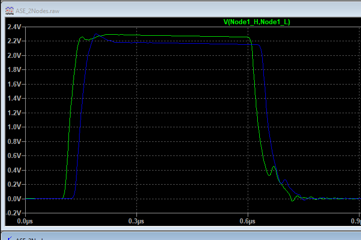
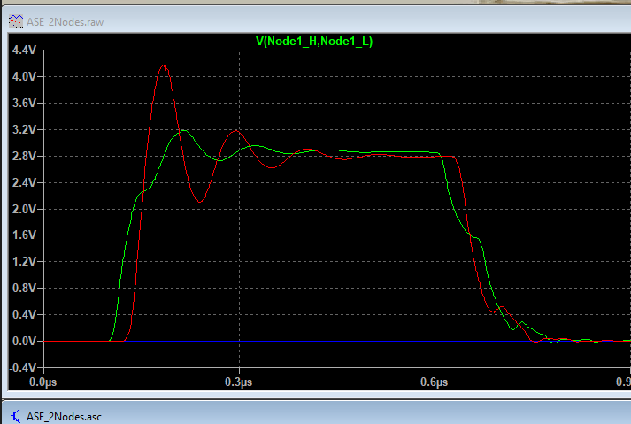

# The physical layer of CAN FD

Daniel Štanc, Jakub Jíra

Measured: 18.4.2023, Documented: 19.4.2023

repository: [japawBlob/B3M38ASE-labs](https://github.com/japawBlob/B3M38ASE-labs)

## Introduction

CAN networks have been deployed in cars and trucks for decades. Physical layer bus topology, which is assumed here, is rarely implemented in cars. This is due to the limited possibilities of wiring harnesses, but also to save the length (weight and volume) of the wiring. The CAN FD variant, which has been used in the last ten years, is particularly sensitive to faulty physical layer topology because it allows communication at higher data rates. The shorter bit time entails higher requirements for transient settling of the transient transients caused by reflections at the impedance jump points.

## Objectives

### Measure the delay of Tx-CAN and CAN-Rx

We connected an oscilloscope to test point 4, marked as J7, to get the CAN signal. For Tx and Rx signals, we connected an oscilloscope to test points 5 and 6, respectively.

Our measured delay of Tx->CAN is **60 ns**, and the delay of CAN->Rx is **62 ns**

### Measure the characteristic impedance of the twisted pair

We measured characteristic impedance by observing the signal on the oscilloscope and tweaking included trimmer to minimalize reflection. 

The measured resistivity of our tweaked trimmer was 114.1 $\Omega$

### Simulate various schemes and observe the cause of long-lasting reflections

During the first simulation, we connected a low-impedance node to our transceiver, and reflections were minimal since low impedance responded to the impedance of the twisted pair. The simulated signal can be seen in the following picture:

When connected to the high-impedance node, the reflections were more noticeable. It is visible in the following picture:

The transceiver's impedance did not have a noticeable impact on the reflection compared to the effects created by the receiver. 

When the distance from the high-impedance receiver is increased, the reflections are more severe and more noticeable. When the distance from the low-impedance receiver is increased, the difference in the signal is hardly noticeable apart from the longer travel time of the signal. 

These findings were also observed on circuits that were of the star type. The impedance of the transceiver is not significant, and the high impedance of the receiver node causes big reflections, which are more significant the more distance there is between the transceiver and receiver. 

Because of other issues, we encountered during lab measurements; we couldn't create a worst-case scenario and measure the maximal feasible transmission speed. However, from our knowledge, we know that these hybrid-star networks are in use in production, where distances between nodes can be up to 20 meters and for that, the maximum CAN speed is lowered from 1Mb/s to only 0.5Mb/s. 

## Conclusion

In this exercise, we got acquainted with the physical layer of CAN. We measured the delay of the CAN controller, resistivity of the used twisted pair conductor and simulated several CAN networks. In these simulations, we measured the amount of reflection based on the distance of the transceiver and receiver nodes, their impedance and topology. We couldn't complete the task of measuring the maximal possible speed, but we at least enclosed an observation from production.