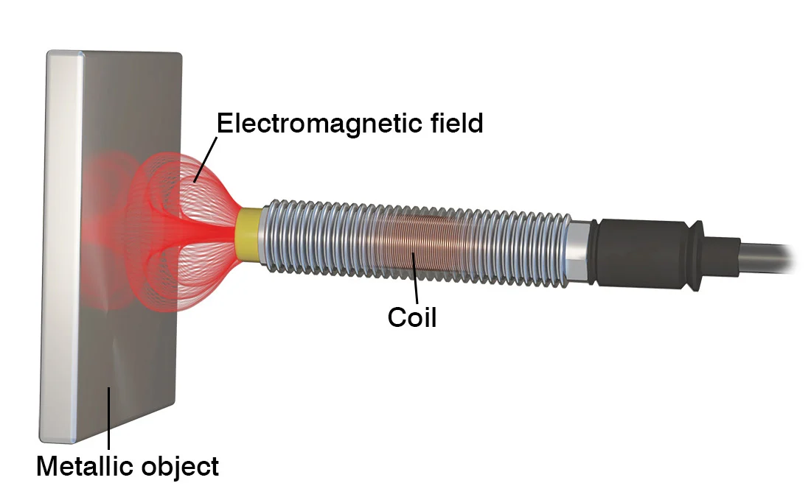
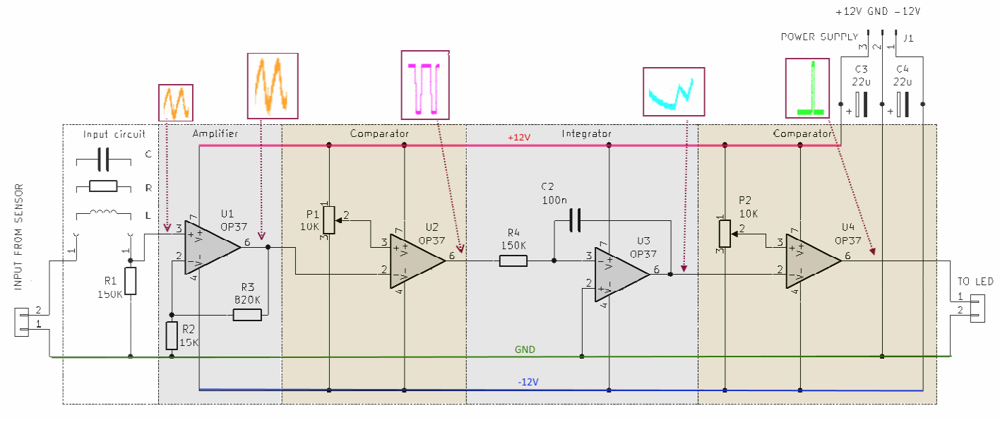

# Rotation speed - magnetic sensors

Daniel Štanc, Jakub Jíra

Measured: 21.3.2023, Documented: 17.5.2023

repository: [japawBlob/B3M38ASE-labs](https://github.com/japawBlob/B3M38ASE-labs)

# Hall and Coil reluctance sensor,

## Hall sensor

The formula for the output voltage of a hall effect sensor is:

$$ U_H = {k \cdot I \cdot B_\perp  } $$

where $B_\perp$ sands for magnetic induction in the perpendicular direction, $I$ stands for current flowing through the hall sensor, and $k$ is the constant. The value of constant $k$ is influenced by sensor design.

The sketch of a hall effect sensor is in the following picture:


The main advantage of the Hall sensor is that it monitors the actual amount of magnetic induction and not just changes in the magnetic field. Also, the output voltage is linear to magnetic induction.

The disadvantage of the hall sensor is the need for an external power supply.

## Coil sensor

The formula for the output voltage of the coil sensor is:

$$ u = -{d\phi \over dt} $$

where $u$ is inducted voltage and $\phi$ is magnetic flux. Here it is apparent that the coil sensor only detects changes in magnetic field, and therefore it is unsuitable for applications where changes in magnetic field are slow.

The advantage of a coil sensor is that coil alone is a generator. Therefore, no external power supply is required. The direction of magnetic induction does not have to be strictly perpendicular as opposed to the hall sensor.

A picture of the coil sensor is below:



# Variable reluctance

Reluctance sensor operates based on changes in the magnetic field caused by the variable reluctance of the magnetic circuit. These sensors typically consist of a magnetic core, a coil, and a target or object whose position and movement affect the magnetic flux.

The object needs to be ferromagnetic as it needs to affect the sensor's magnetic field. 

The main advantage of this sensor for measuring rotation is the simplicity of the design. We only need a toothed wheel made from a ferromagnetic material and a coil sensor.

# Detector

The following picture captures the signal produced by the sensor with a magnet attached. 


In the waveform, we can observe where is the "no tooth" section of the wheel, where the magnetic induction is constant, and therefore output signal is constant as well.

From this waveform, we can compute revolutions per minute. We measured a period of 60.1ms. Using the following formula, we can calculate RPM:

$$ RPM = {60 \over 60.1 \cdot 10^{-3}} = 998 rev/min $$

For the detection of the missing tooth following analogue circuit was provided:



The displayed waveform in the picture above is sampled from where the signal enters the circuit. 

In the first section, on the picture displayed in orange, the signal is the same as in the picture, only amplified. It is followed by a comparator section, which inverts the signal. Comparation and inversion causes the signal in high to represent a metallic tooth, and the signal in low represents the lack of tooth, otherwise known as air. 

The following section is an integrator. Its signal grows and decreases based on a signal from the previous section. It increases when the tooth is present and decreases when the tooth is missing. When the integrated amount reaches a certain threshold, the next part of the circuit generates a pulse - signalling the full revelation.

# Algorithm

Since we know the number of teeth on the wheel, we need to determine a suitable sampling period to detect each tooth's absence safely. We will count each missing tooth, and when our counter reaches the number of teeth, we will generate an impulse. 

Pseudocode could be as follows: (rust-like language is used for pseudocode)

```rust
const number_of_teeth;
loop {
    let mut counter = 0;
    while counter < number_of_teeth {
        if sample_sensor_value() == LOW {
            counter += 1;
            while sample_sensor_value() == LOW {}
        }
    }
    generate_pulse();
}
```

This pseudocode will generate a pulse each revelation. For the pulse to be generated at the beginning of the missing tooth segment, some previous calibration of the counter would be required. One such calibration could be as follows: 
```rust
let mut max_time = 0;
loop {
    if sample_sensor_value() == HIGH {
        start_timer();
    }
    while sample_sensor_value() == HIGH {}
    let high_duration = get_timer();
    if high_duration >= max_time {
        max_time = high_duration;
        /// Set start point for counting
    }
}

```
This way, after a few rotations, the start point would always be after the missing tooth segment since it is the longest-lasting HIGH signal. We could add some tolerance variable to the max_time in the if statement to make it more suitable for real-world application. 

We can add those two code snippets together and get the following code:

```rust
const number_of_teeth;
let mut tolerance = ???;
let mut max_time = 0;
let mut counter = 0;
loop {
    if sample_sensor_value() == HIGH {
        start_timer();
    }
    while sample_sensor_value() == HIGH {}
    let high_duration = get_timer();
    if max_time-tolerance <= high_duration <= max_time+tolerance {
        max_time = high_duration;
        counter = 0;
        /// calibrate tolerance
    }
    if sample_sensor_value() == LOW {
        counter += 1;
        while sample_sensor_value() == LOW {}
    }
    if counter >= number_of_teeth{
        generate_pulse();
    }
}
```

The tolerance variable should be modified during a run in order to comply with the changing speed of revelations. 